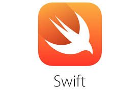

# Introduction

This is my Swift applications (open part) from bootcamps, open source, etc.
To see my activity visit: https://gitlab.com/prostiak        
        
     

**Project list**
---

1. Regular projects

    + MyPlaces        
    + BitcoinTicker    
    + Turn on stealth mode?

2. AR projects

    + Enable Gatekeeper?
    	- Defend against malware by enforcing code signing and verifying downloaded applications before allowing them to run.
    + Prevent automatic software whitelisting?
        - Both built-in and downloaded software will require user approval for whitelisting.
    + Disable Captive Portal Assistant and force login through browser on untrusted networks?
        - Captive Portal Assistant could be triggered and direct you to a malicious site WITHOUT any user interaction.

3. ML projects

    + Clear language modeling metadata?
        - This includes user spelling, typing and suggestion data.
    + Disable language modeling data collection?
    + Clear QuickLook metadata?
    + Clear Downloads metadata?
    + Disable metadata collection from Downloads?
    + Clear SiriAnalytics database?
